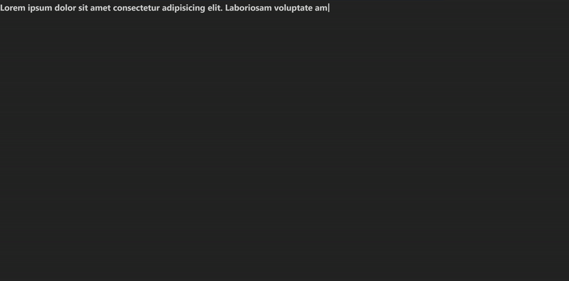

Create auto typing effect in React. Zero dependencies. Use a hook or a built-in component with an optional blinking cursor which can be customized



## Installation

```
npm i use-typewriter-react
```

## Usage

### Hook

```
useTypewriter({
    phrases: ["Phrase 1", "This is phrase 2"],
    options: {
        typingSpeed: {
            numUnits: 4,
            timeMs: 100,
            startDelayMs: 1000,
        },
        erasingSpeed: {
            numUnits: 8,
            timeMs: 100,
            startDelayMs: 5000,
        },
        loopLimit: 2,
    },
})
```

#### Props

1. `phrases`: List of strings to auto type.
2. `options`
   1. `typingSpeed` - Used when typing
      1. `numUnits`: Number of character to type in one instance.
      2. `timeMs`: The time delay in milliseconds between each instance.
      3. `startDelayMs`: Delay before starting to type. This applies to all phrases in the array including the first.
   2. `erasingSpeed` - Same arguments and meaning as typingSpeed but for erasing. `startDelayMs` is the duration after which a completed phrase will start erasing.
   3. `loopLimit` - **Optional**. Define the number of times phrases list should loop. One loop in considered complete if the last phrase in the array is fully typed which is where the typewriter will stop when limit is reached. If not defined will continue indefinitely.

### Component

No styling assumptions have been made here. This component can be wrapped in any other and it'll adopt the styles of its parent.

```
<Typewriter
    phrases={[
        "Phrase 1",
        "This is phrase 2",
    ]}
    options={{
        typingSpeed: {
            numUnits: 4,
            timeMs: 100,
            startDelayMs: 1000,
        },
        erasingSpeed: {
            numUnits: 8,
            timeMs: 100,
            startDelayMs: 5000,
        },
        loopLimit: 2,
        cursor: "|"
    }}
></Typewriter>
```

#### Props

Same as the hook with addition of:

1. `cursor`: **Optional**. Built-in blinking cursor. Possible values are `_` or `|`
2. `customCursor`: **Optional**. Accepts any component. No styling or blinking effect is applied so user has full control. If provided, `cursor` will be ignored.
